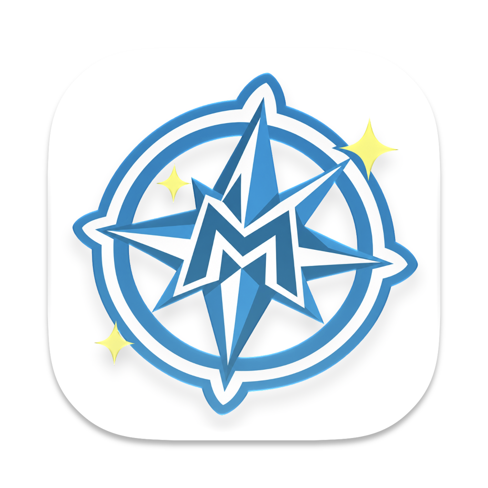

<p align="center">
  
</p>

<h1 align="center">MyGO-Clash</h1>

<p align="center">
  基于 <a href="https://github.com/MetaCubeX/mihomo">mihomo</a> 内核与 <a href="https://github.com/egoist/mygo">MyGo</a> 框架的跨平台代理客户端<br>
  <i>迷子でもいい、前へ進め。</i>
</p>

<p align="center">
  <b>简体中文</b> · <a href="README.en.md">English</a> · <a href="README.ja.md">日本語</a>
</p>

<p align="center">
  
  
  
  
</p>

> [!NOTE]
> MyGO-Clash 目前是 v0.1.0 早期预览版。界面和主要流程已在 macOS（Apple Silicon）上测试；TUN 与系统服务、系统代理切换、Tailscale 登录、WebDAV 同步，以及在 Windows 和 Linux 上的运行，还没有在真实环境中充分验证。遇到问题欢迎提 [Issue](https://github.com/Souitou-iop/MyGO-Clash/issues)。

## 功能

### 代理

- 内置 mihomo 内核，作为独立进程运行；安装系统服务后可开启 TUN 模式
- 规则、全局、直连三种模式，在首页、托盘、快捷面板和全局快捷键里都能切换
- 系统代理：绕过列表、PAC 脚本，被其他软件改掉时自动恢复
- TUN：Mixed、gVisor、System 三种协议栈，自动路由、严格路由、DNS 劫持、排除网段
- 节点延迟测试与自动测速，切换节点或模式时可自动断开旧连接
- 局域网共享、IPv6、进程匹配，以及供 Web 面板使用的外部控制器

### 订阅与配置

- 远程订阅：显示已用流量和到期时间，定时自动更新，无法直连的订阅可以通过代理更新
- 本地配置文件，内置 YAML 编辑器
- 扩展：全局或单个配置的 YAML 合并、JavaScript 脚本，以及规则、节点、代理组的前置、追加、删除
- 粘贴分享链接（vmess://、ss://、trojan://、vless://、hysteria2:// 等）导入节点
- 点击 `clash://install-config?url=…` 链接一键导入订阅

### Tailscale

- 内置用户态 Tailscale 节点：不用另装软件，也不需要管理员权限；也可以接管本机已安装的 Tailscale
- 通过规则使用子网路由和出口节点，支持 MagicDNS，以及 Headscale 等自建控制服务器
- 同一账号的其他设备可以通过 Tailscale 地址使用这台电脑的代理
- 让 TUN 模式和 Tailscale 互不干扰

### 同步与备份

- 通过任意 WebDAV 服务（Nextcloud、坚果云、群晖、InfiniCLOUD……）在多台电脑间同步订阅和设置
- 端到端加密：口令经 Argon2id 派生密钥，每个文件用 XChaCha20-Poly1305 加密，文件名也经过隐藏
- 同一份订阅在两台设备上都改过时会提示冲突，设置则按字段合并；TUN、快捷键等设备相关的设置不参与同步
- 备份到本地或 WebDAV，也可以导出为加密文件

### 实用工具

- 解锁检测：Netflix、Disney+、YouTube Premium、ChatGPT、Claude、Gemini、Spotify、TikTok、Steam 货币区
- 出口 IP 查询与常用网站连通性检测
- 连接、规则、日志页面

### 桌面体验

- 托盘菜单（模式、节点、订阅、Tailscale）、托盘网速、原生快捷面板、全局快捷键
- 首页卡片可以自由开关、排序，布局随窗口宽度自动调整
- 浅色、深色主题和多种强调色，可自定义字体与 CSS；界面支持简体中文和英文
- 窗口不在前台时，错误和警告通过系统原生通知提示，点击直接打开相关页面
- 轻量模式：关闭网页视图以节省内存，内核和托盘照常运行
- 开机自启、静默启动，一键复制终端用的代理环境变量
- 订阅地址、密码等敏感信息加密保存，密钥放在系统的安全存储中（macOS 钥匙串、Windows DPAPI、Linux Secret Service）
- Windows 上可一键解除 Microsoft Store 应用的回环限制
- macOS 26 及以上，应用图标跟随系统的浅色、深色、透明和着色外观

## 下载

还没有发布正式版本，目前请从源码构建（见下文）。发布后可以在 [Releases](https://github.com/Souitou-iop/MyGO-Clash/releases) 页面下载。

## 从源码构建

需要：

- [Go](https://go.dev/dl/) 1.27.1 或更高版本
- [Bun](https://bun.sh)
- Linux：GTK 3 和 WebKitGTK 4.1，例如 Debian / Ubuntu 上 `sudo apt install libwebkit2gtk-4.1-0`
- Windows 10：[WebView2 Runtime](https://developer.microsoft.com/microsoft-edge/webview2/)（Windows 11 已自带）

```bash
git clone https://github.com/Souitou-iop/MyGO-Clash.git
cd MyGO-Clash
bun install
bun run dev     # 开发模式，修改后自动重新构建
bun run build   # 打包当前平台，输出到 build/
```

请通过 `package.json` 里的脚本构建：它们会加上 mihomo 需要的 `-tags=with_gvisor`。修改 Go 侧的接口后，用 `bun run generate` 重新生成前端绑定 `src/mygo.ts`。

应用图标来自 Icon Composer 文件。修改设计后，在装有 Xcode 26 或更高版本的 Mac 上运行下面的命令，重新生成 macOS 的 `Assets.car`、其他平台用的 `icon.png` 和界面里的图标：

```bash
go run ./cmd/genicon path/to/MyGo-Clash.icon
```

## 项目结构

```
main.go              入口：同一个可执行文件运行应用、内核（core）或特权服务（service）
internal/app         窗口、托盘、快捷面板、通知、设置与前端接口
internal/corehost    运行 mihomo 内核
internal/coremgr     以独立进程或系统服务的方式管理内核
internal/service     TUN 所需的特权服务
internal/profiles    订阅与配置文件
internal/enhance     合并、脚本等配置扩展
internal/tailnet     Tailscale 集成
internal/cloudsync   端到端加密同步
internal/sysproxy    系统代理
src/                 React 前端
cmd/genicon          从 Icon Composer 文件生成各平台图标
```

## 致谢

- [mihomo](https://github.com/MetaCubeX/mihomo)：代理内核
- [MyGo](https://github.com/egoist/mygo)：跨平台桌面应用框架
- [Tailscale](https://tailscale.com)：组网能力

## 声明

- MyGO-Clash 是非官方的同人致敬项目。名称、配色以及罗盘与拨片图案致敬《BanG Dream!》中的乐队 MyGO!!!!!，与 Bushiroad 及乐队官方没有任何关系。
- 本软件仅供学习和研究网络技术使用，请遵守所在地区的法律法规。

## 许可证

[GPL-3.0](LICENSE)
